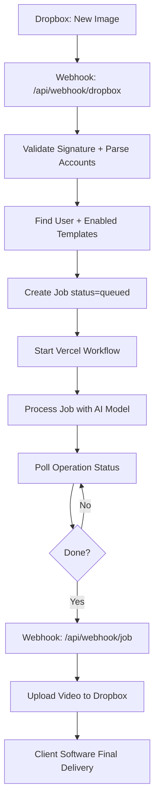
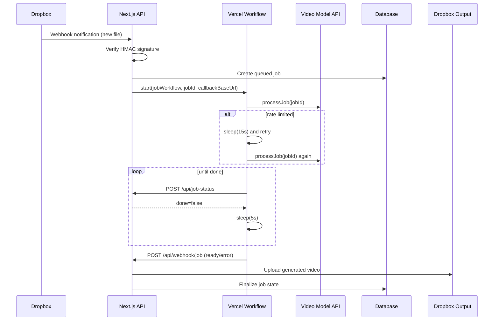
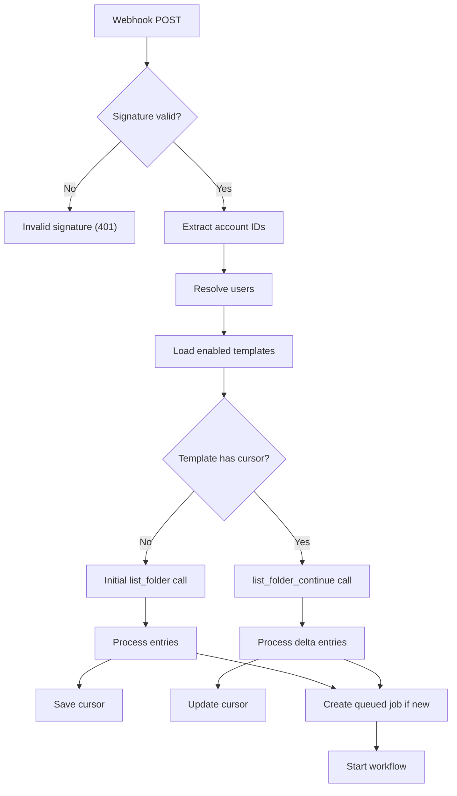
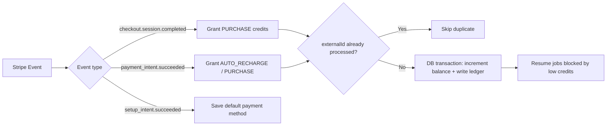

# From Vibecoding to Revenue: Building an AI B2B SaaS

I just vibecoded an AI B2B SaaS that is generating revenue.

A friend contacted me. He runs a photobooth company for corporate events and wanted to add animated avatars to his experience.  
He already had software that generates avatars and drops files into Dropbox for delivery.

So I built the missing piece: a service that listens for new images, processes them with AI video generation, and stores results back in Dropbox so his existing software stays in charge of final delivery.

That is how this project was born.

---

## The Real-World Problem

Most AI demos fail in production because they do not fit real operations.

In this case, the operation was clear:

1. A new avatar image arrives in Dropbox
2. The system detects it automatically
3. A processing job is created
4. The AI model generates an animated result
5. The output is uploaded back to Dropbox
6. Existing client software delivers the final experience

No manual handoff, no operator babysitting, no fragile scripts.

---

## System Architecture

This stack is built around:

- Next.js API routes (on Vercel)
- Vercel Workflows for durable orchestration
- Prisma + database-backed job state
- Dropbox webhooks and cursor-based folder sync
- Stripe webhooks for credit billing and auto-recharge

### High-Level Architecture

---

## Vercel Workflow Design

The key technical decision was to use one durable **Vercel Workflow run per job**.

Instead of stitching Cloud Tasks + Step Functions, the workflow itself handles:

- processing
- retrying on rate limits
- polling long-running operations
- final callback

### Workflow Sequence

---

## Dropbox Ingestion Details

The Dropbox webhook route is built for production safety:

- validates `x-dropbox-signature` using app secret + HMAC SHA-256
- supports account id normalization (`dbid:` variants)
- reads templates with source folders enabled
- uses `list_folder` + `list_folder/continue` with persisted cursor
- deduplicates files to avoid duplicate jobs during rapid webhook bursts
- starts workflow asynchronously per new job

### Ingestion and Cursor Handling

---

## Billing and Revenue Mechanics

Revenue reliability matters as much as generation quality.

The Stripe webhook route handles:

- checkout credit purchases
- payment-intent success for auto-recharge
- setup-intent default payment method handling
- idempotent credit grants via unique `externalId`
- transactional balance updates and credit transaction recording
- re-queueing jobs previously blocked by insufficient credits

### Credit Lifecycle

---

## Why This Is More Than a Demo

This project is not "just AI generation". It is a full B2B workflow system:

- event-driven ingestion
- durable orchestration
- fault-aware retries
- idempotent billing
- operational observability
- smooth integration into an existing business toolchain

If your system can run in production, solve a client's problem, and generate revenue, that is engineering work.

---

## "Am I an AI engineer now?"

If you can:

- map a business need to a technical architecture,
- ship reliable AI operations end-to-end,
- handle failures and billing safely,
- and create measurable business value,

then yes: you are doing AI engineering.

Title is optional. Delivery is not.

