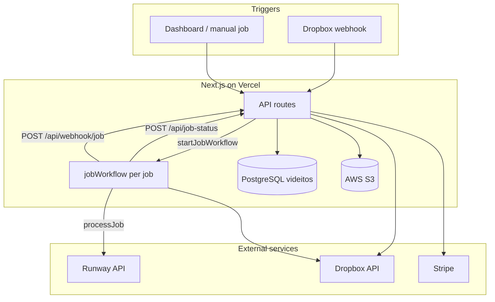
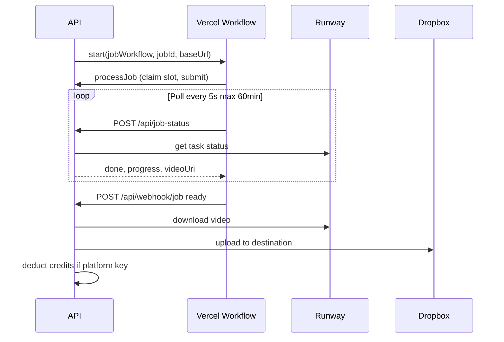

# Architecture

Developer-oriented overview of Videitos: how components fit together, what is stored where, and where to look in the codebase.

## Overview

Videitos is a B2B SaaS for **automated image-to-video** from Dropbox:

1. User connects **Dropbox** and creates a **template** (source folder, destination folder, model, prompts).
2. New images in the source folder (via webhook or sync) create **jobs** (`queued`).
3. A **Vercel Workflow** run per job claims a Runway slot, submits generation, polls until done, then uploads the video to Dropbox and charges **credits** if using the platform Runway key.
4. The dashboard shows job status, workflow phase, and Runway poll progress.

## System diagram

### Job workflow loop (simplified)

Full step-by-step behavior: [workflow.md](workflow.md).

## Data model

PostgreSQL schema **`videitos`** ([prisma/schema.prisma](../prisma/schema.prisma)).

### Entities

| Model | Purpose |
|-------|---------|
| `User` | Auth, Dropbox tokens, credit balance, Stripe customer, optional `runwayApiKey` / `googleAiStudioApiKey` |
| `Template` | Model id, JSON `config`, Dropbox source/destination paths and cursor |
| `Job` | One generation run: status, provider task id, costs, workflow observability fields |
| `CreditTransaction` | Grants, spends, purchases, auto-recharge (Stripe `externalId` for dedup) |
| `Session` | Cookie session; optional `impersonatorUserId` for admin impersonation |

### Job statuses

Defined in [src/lib/constants/job-status.ts](../src/lib/constants/job-status.ts):

| Status | Description |
|--------|-------------|
| `queued` | Created, not yet processing |
| `processing` | Runway task submitted and/or upload in progress |
| `completed` | Output in Dropbox |
| `failed` | Error or user cancel |

### Job fields (observability & retries)

| Field | Use |
|-------|-----|
| `workflowRunId` | Vercel Workflow run id (cancel via API) |
| `workflowPhase` | UI label; updated from workflow steps |
| `runwayProgress` | Last Runway progress 0–1 during poll |
| `runwayPollStatus` | Last Runway task status string (PENDING, RUNNING, …) |
| `providerOperationId` | Runway task id |
| `runwayOutputVideoUri` | Ephemeral Runway output URL; kept for Dropbox upload retries |
| `rateLimitClaimedAt` | Slot claimed before provider call |
| `preGenImageKey` / `sourceThumbnailKey` | S3 keys for UI |

### Workflow phases

Stored in `Job.workflowPhase` while active ([src/lib/constants/job-workflow-phase.ts](../src/lib/constants/job-workflow-phase.ts)):

`starting` → `claiming_slot` → `preparing` → `submitting` → (`waiting_rate_limit` | `waiting_runway_credits`) → `generating` → `polling` → `uploading` → (`waiting_dropbox_rate_limit`)

Labels for the dashboard: [src/lib/job-workflow-phase-label.ts](../src/lib/job-workflow-phase-label.ts).

## Templates and models

- `Template.model` is one of the Runway image-to-video ids in [src/lib/video-models.ts](../src/lib/video-models.ts): `gen4.5`, `gen4_turbo`, `veo3.1`, `veo3.1_fast`.
- `Template.config` is JSON (prompts, duration, aspect ratio, optional text-to-image pre-gen, etc.) parsed by `parseTemplateConfig()`.
- Rate limits per model: `maxConcurrent` (default 3), `requestsPerWindow`, `windowSeconds`. Enforced in `processJob()` via DB transaction counting active jobs.

## Credits and billing

- **Balance**: `User.creditBalance` (decimal).
- **Pricing**: [src/lib/credits.ts](../src/lib/credits.ts) `computeJobCost()` from model + template config.
- **Charge**: On job completion when `usesPlatformKey()` — spend recorded on `CreditTransaction` with `kind: spend`.
- **Top-up**: Stripe Checkout ([src/app/api/credits/checkout/route.ts](../src/app/api/credits/checkout/route.ts)), webhook [src/app/api/webhook/stripe/route.ts](../src/app/api/webhook/stripe/route.ts).
- **Auto-recharge**: [src/lib/stripe.ts](../src/lib/stripe.ts) `maybeAutoRecharge()` when balance drops below threshold.

Users with their own **Runway API key** are not charged Videitos credits for generation (they pay Runway directly).

## Storage

### Dropbox

- Source file path (and optional `dropboxSourceFileId`) per job.
- Template `dropboxSourcePath` / `dropboxDestinationPath` and `dropboxSourceCursor` for incremental sync.
- Completed jobs: `outputDropboxPath`.

Sync and job creation: [src/lib/dropbox-template-sync.ts](../src/lib/dropbox-template-sync.ts).

### S3

Used when AWS credentials are configured ([src/lib/s3.ts](../src/lib/s3.ts)):

| Key pattern | Purpose |
|-------------|---------|
| `sourceThumbnailKey` | Cached Dropbox source thumbnail |
| `preGenImageKey` | Text-to-image pre-generation output |
| Pending job video | Buffer when Dropbox returns 429; retried by workflow |

## Authentication and roles

- Session cookie via [src/lib/auth.ts](../src/lib/auth.ts) (`SESSION_SECRET`).
- Roles: `user` | `admin` ([src/lib/constants/user-role.ts](../src/lib/constants/user-role.ts)).
- Admin routes under `/dashboard/admin/*` and `/api/admin/*`.
- Impersonation: admin sets `Session.impersonatorUserId`; banner in dashboard layout.

## API routes (grouped)

| Group | Examples |
|-------|----------|
| Auth | `/api/auth/login`, `/api/auth/logout`, `/api/auth/session` |
| Templates | `/api/templates`, `/api/templates/[id]`, `/api/templates/references/url` |
| Jobs | `/api/jobs`, `/api/jobs/[id]/cancel`, `/api/jobs/[id]/retry`, `/api/jobs/[id]/details` |
| Job processing | `/api/job-status`, `/api/webhook/job`, `/api/jobs/start-execution` |
| Dropbox | `/api/dropbox/auth`, `/api/dropbox/callback`, `/api/dropbox/folders`, `/api/webhook/dropbox` |
| Credits | `/api/credits`, `/api/credits/checkout`, `/api/webhook/stripe` |
| Admin | `/api/admin/users`, `/api/admin/users/[id]/impersonate`, `/api/admin/jobs/[id]/retry-upload` |
| User settings | `/api/user/settings` |

Workflow-internal callbacks (called by the workflow with `callbackBaseUrl` = `HOSTNAME`):

- `POST /api/job-status` — poll Runway; updates `runwayProgress` / `runwayPollStatus`
- `POST /api/webhook/job` — complete or fail job; Dropbox upload + credits

## Key libraries

| Module | Responsibility |
|--------|----------------|
| [process-job.ts](../src/lib/process-job.ts) | Rate-limit claim, download source, pre-gen, submit Runway task |
| [start-job-workflow.ts](../src/lib/start-job-workflow.ts) | `start(jobWorkflow)` + persist `workflowRunId` |
| [job-workflow.ts](../src/workflows/job-workflow.ts) | Durable workflow: process, poll, webhook, retries |
| [complete-job-with-runway-video.ts](../src/lib/complete-job-with-runway-video.ts) | Download video, upload Dropbox, deduct credits |
| [runway.ts](../src/lib/runway.ts) | Runway API client |
| [runway-api-key.ts](../src/lib/runway-api-key.ts) | User vs platform API key resolution |
| [dropbox-template-sync.ts](../src/lib/dropbox-template-sync.ts) | Webhook/sync → create jobs → start workflows |
| [persist-runway-poll-status.ts](../src/lib/persist-runway-poll-status.ts) | Dashboard poll fields |
| [persist-runway-video-uri.ts](../src/lib/persist-runway-video-uri.ts) | Save ephemeral output URL |
| [cancel-runway-task-for-job.ts](../src/lib/cancel-runway-task-for-job.ts) | Best-effort Runway task cancel |
| [cancel-job-workflow-run.ts](../src/lib/cancel-job-workflow-run.ts) | Cancel Vercel Workflow run |
| [is-job-canceled.ts](../src/lib/is-job-canceled.ts) | `errorMessage === "Canceled"` |
| [reconcile-stuck-jobs.ts](../src/lib/reconcile-stuck-jobs.ts) | Repair stuck processing jobs |
| [reconcile-stuck-dropbox-uploads.ts](../src/lib/reconcile-stuck-dropbox-uploads.ts) | Retry failed Dropbox uploads |

## Admin surfaces

| Path | Purpose |
|------|---------|
| `/dashboard/admin/users` | User list, create, edit, impersonate |
| `/dashboard/admin/revenue` | Stripe revenue view |
| `/dashboard/admin/dropbox-uploads` | Jobs stuck on Dropbox upload; manual retry |

## Related docs

- [workflow.md](workflow.md) — Vercel Workflow pipeline, retries, env vars, observability
- [ai-b2b-saas-article.md](ai-b2b-saas-article.md) — product context
- [README.md](../README.md) — local setup and deployment
